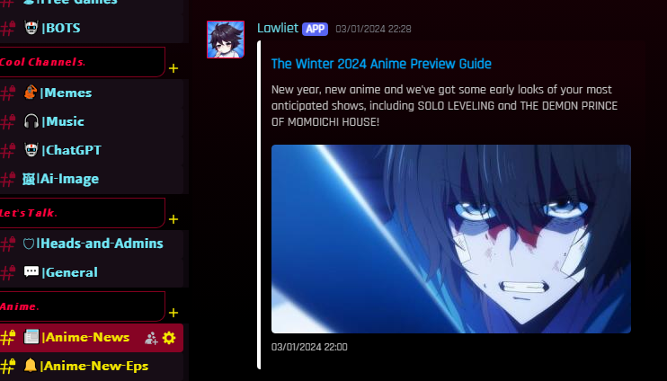
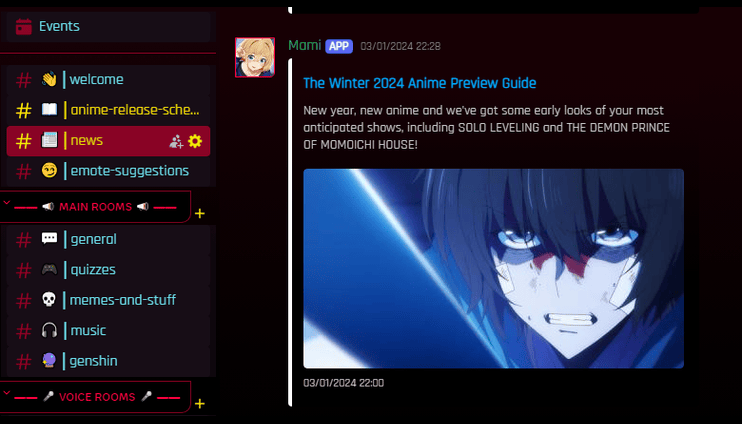

# Multi-Channel Automated Message Integration Bot

## Description
This Discord bot relays messages from a specified source channel to a target channel within the same server. It is designed to facilitate communication by automatically forwarding messages, making it useful for announcements or updates between different channels.

## Features
- **Automatic Message Relay**: Sends messages from a source channel to a target channel seamlessly.
- **Simple Configuration**: Users only need to input their bot token and channel IDs to get started.
- **Keep-Alive Functionality**: Hosted on Replit to ensure the bot remains online.

## Prerequisites
Ensure you have the following:
- A **Replit** account (you can sign up for free at [Replit.com](https://replit.com/)).
- Basic understanding of how to use Replit.

## Installation

1. **Fork the repository**:
   Fork this repository or create a new Replit project and copy the code into it.

2. **Install dependencies**:
   Open the Replit shell and run the following command to install the required packages:
   ```bash
   pip install discord.py flask python-dotenv
   ```

3. **Create a `.env` file**:
   In Replit, create a new file named `.env` and add the following variables:
   ```env
   TOKEN=YOUR_BOT_TOKEN
   ID1=SOURCE_CHANNEL_ID
   ID2=TARGET_CHANNEL_ID
   ```

   Replace `YOUR_BOT_TOKEN` with your actual Discord bot token (make one through here https://discord.com/developers/applications), `SOURCE_CHANNEL_ID` with the ID of the channel you want to listen to, and `TARGET_CHANNEL_ID` with the ID of the channel where you want to send messages.

5. **Run the bot**:
   Click the "Run" button in Replit. The bot should start running, and you will see "Bot is ready" in the console.

## Usage
Once the bot is running, it will automatically relay messages from the specified source channel to the target channel. Simply send a message in the source channel, and the bot will forward it to the target channel.

## How It Works
- **Original Message in Source Channel**:
  

- **Message Sent by the Bot in Target Channel**:
  

## Example Configuration

```env
TOKEN=MzA5MTY5MzU3NTAxNTE3NjU4.YZi8Nw.OiWq1xgXv9Zb6eH_1t2dH2KkRUk
ID1=123456789012345678
ID2=987654321098765432
```

## Hosting
**(UPDATE FEB 2024)**

**UptimeRobot no longer fully collaborates with Replit, as Replit has [limited the ability to create web domains](https://uptimerobot.com/blog/replit-monitors-recent-issues/). Therefore, deployments are now necessary to keep the bot alive.**

This bot is set up to run on Replit, which provides a simple web interface that keeps your bot alive and responsive. ~~To ensure it continues to run even when you close the tab, monitor the URL domain created using [UptimeRobot](https://uptimerobot.com/).~~

If the bot isn't running, check for any errors by reviewing the console logs. If it has become rate-limited, use the command `kill 1` to reset the bot completely.

## Contributing
Contributions are welcome! Feel free to open issues or submit pull requests for new features or bug fixes.

## License
This project is licensed under the MIT License. See the [LICENSE](LICENSE) file for details.

## Acknowledgments
- [discord.py](https://discordpy.readthedocs.io/en/stable/) - A powerful library to interact with the Discord API.
- [Flask](https://flask.palletsprojects.com/en/2.0.x/) - A lightweight WSGI web application framework for Python.
